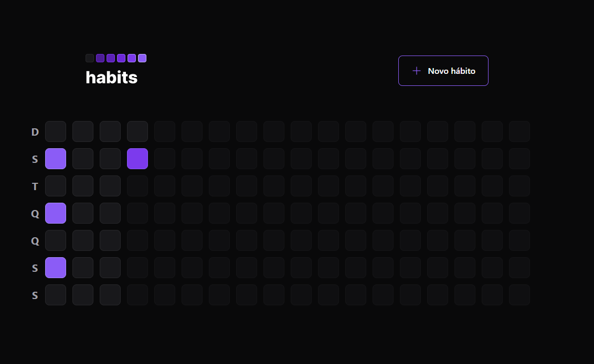
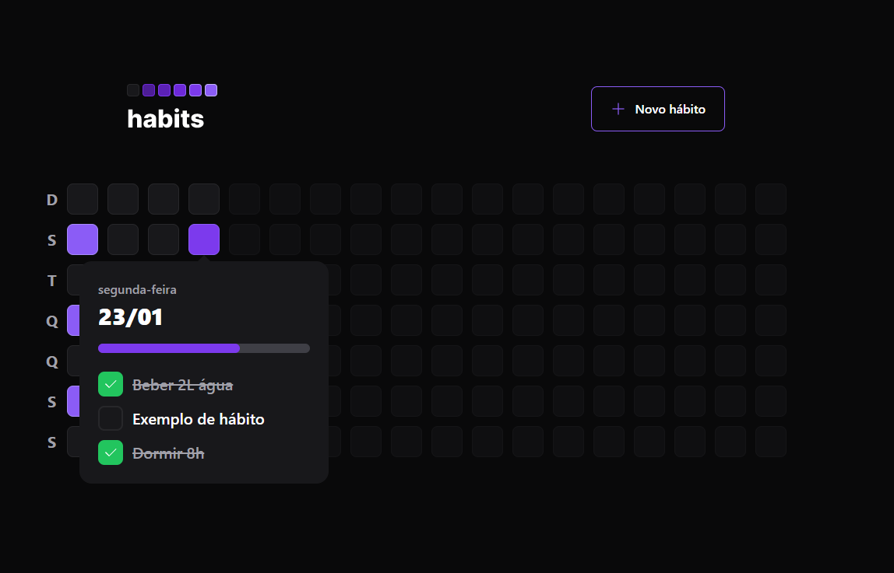
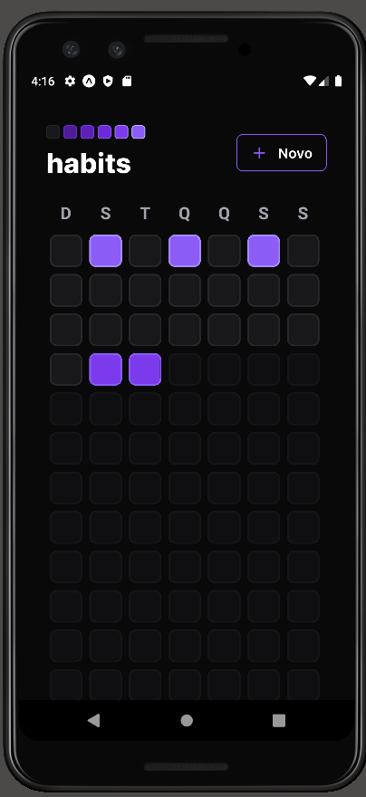

<h1 align="center">Next Level Up - Setup</h1>

<p align="center">
Evento exclusivo e gratuito, promovido pela Rocketseat.
Foram 5 dias de aula, totalizando um pouco mais de 10 horas de vídeo, desenvolvendo uma API em NodeJS, um Front-end em React e uma aplicação mobile em React Native.
</p>

<p align="center">
  <a href="#-tecnologias">Tecnologias</a>&nbsp;&nbsp;&nbsp;|&nbsp;&nbsp;&nbsp;
  <a href="#-iniciando-a-aplicação">Iniciando</a>&nbsp;&nbsp;&nbsp;|&nbsp;&nbsp;&nbsp;
  <a href="#-projeto">Projeto</a>&nbsp;&nbsp;&nbsp;|&nbsp;&nbsp;&nbsp;
  <a href="#memo-licença">Licença</a>&nbsp;&nbsp;&nbsp;|&nbsp;&nbsp;&nbsp;
  <a href="#-contato">Contato</a>
</p>

<p align="center">
  
</p>

<br>

<p align="center">
  
</p>
<p align="center">
  
</p>
<p align="center">
  
</p>

## 🚀 Tecnologias

Esse projeto foi desenvolvido com as seguintes tecnologias:
* __Typescript__
* Back-end
  * __Node__ + __Zod__ + __Cors__ + __Fastify__
  * __Prisma ORM__ para acessar o banco de dados
  * __dayjs__ para trabalhar com datas
* Front-end
  * __React + Vite__
  * __Tailwind CSS__ para estilização.
  * __Clsx__ para estilização.
  * __phosphor-react__ para icones
  * __Radix__ 
  * __dayjs__ para formatar datas.
  * __Axios__ para acessar a API.
* Front-end
  * __React Native__
  * __Expo__
  * __Nativewind__

## :car: Iniciando a aplicação
Baixe o repositório com git clone e entre nas pastas(web, mobile e server) para instalar as dependencias do projeto. Deixe o servidor executando e inicia as instanciâs desktop ou mobile.<br/>
```bash
$ git clone https://github.com/MarlonChi/nlw-setup
```
* Back-end
```bash
$ cd server
$ npm install
$ npm run dev
```
* Front-end
```bash
$ cd ..
$ cd web
$ npm install
$ npm run dev
```
* Mobile (Para isso, precisa ter um emulador aberto no computador ou conectar um celular android ligado por usb, baixar o app do expo na store e executar os comandos abaixo)
```bash
$ cd ..
$ cd mobile
$ npm install
$ npx expo start
```

## 💻 Projeto

O Habits é um projeto composto de uma api desenvolvida com Node.js, um client desktop utilizando React, além de um aplicativo mobile utilizando React Native.
A aplicação possui uma tela principal listando os dias do ano, ao clicar em cada quadrado referente ao dia, é exibido um popover contendo os hábitos do dia, também possuí uma tela para cadastrar novos hábitos.<br/>

## :memo: Licença

Esse projeto está sob a [licença MIT](LICENSE).

## :email: Contato

E-mail: [**marlonchiodelli@hotmail.com**](mailto:marlonchiodelli@hotmail.com)
---